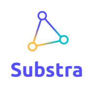

# 

CLI and SDK for interacting with Substra platform.

## Table of contents

- [Install](#install)
- [Running the Substra platform locally](#running-the-substra-platform-locally)
- [Usage](#usage)
- [Documentation](#documentation)
- [Contributing](#contributing)

## Install

To install the command line interface and the python sdk, run the following command:

```sh
pip install substra
```

To enable Bash completion, you need to put into your .bashrc:

```sh
eval "$(_SUBSTRA_COMPLETE=source substra)"
```

For zsh users add this to your .zshrc:

```sh
eval "$(_SUBSTRA_COMPLETE=source_zsh substra)"
```

From this point onwards, substra command line interface will have autocompletion enabled.

## Running the Substra platform locally

You can run the Substra platform locally on your machine using one of the two following methods:

* [Using kubernetes and skaffold (recommended)](./docs/local_install_skaffold.md)
* [Using docker-compose](./docs/local_install_docker_compose.md)

## Usage

Credentials are required for using this tool.

### CLI

```sh
substra --help
```

### SDK

```python
import substra

client = substra.Client()
# enjoy...
```

## Documentation

Interacting with the Substra platform:

- [Command line interface](./references/cli.md)
- [SDK](./references/sdk.md)

Implementing your assets in python:

- [Objective base class](https://github.com/SubstraFoundation/substra-tools/blob/dev/docs/api.md#metrics)
- [Dataset base class](https://github.com/SubstraFoundation/substra-tools/blob/dev/docs/api.md#opener)
- [Algo base class](https://github.com/SubstraFoundation/substra-tools/blob/dev/docs/api.md#algo)

Learning about the Substra platform:

- [Concepts](./docs/concepts.md)
- [Machine Learning tasks](./docs/ml_tasks.md)
- [Adding a full pipeline](./docs/full_pipeline_workflow.md)
- [Adding data samples](./docs/add_data_samples.md)

## Examples

- [Titanic](./examples/titanic/README.md)
- [Cross-validation](./examples/cross_val/README.md)
- [Compute plan](./examples/compute_plan/README.md)

## Contributing

### Setup

To setup the project in development mode, run:

```sh
pip install -e .[test]
```

To run all tests, use the following command:

```sh
python setup.py test
```

### Documentation

To generate the command line interface documentation, run the following command:

```sh
python bin/generate_cli_documentation.py
```

Use the following command to generate the python sdk documentation:

```sh
pydocmd simple substra.sdk+ substra.sdk.Client+ > references/sdk.md
```

Documentation will be available in *docs/* directory.


### Deploy

Deployment to pypi.org should be automatic thanks to Travis but if you need to do it manually, here is what you need to do:

```sh
rm -rf dist/*
python3 setup.py sdist bdist_wheel
twine upload dist/* --verbose
```
