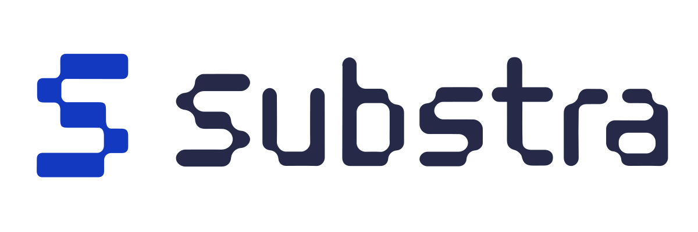

<div align="left">
<a href="https://join.slack.com/t/substra-workspace/shared_invite/zt-1fqnk0nw6-xoPwuLJ8dAPXThfyldX8yA"></a> <a href="https://docs.substra.org/"></a>
<br /><br /></div>

<div align="center">
  
</div>

Substra is a python library and a command line interface to interact with the Substra platform.
For more information on what is substra and how to use it, please refer to the [user documentation](https://docs.substra.org/).

Join the discussion on [Slack](https://join.slack.com/t/substra-workspace/shared_invite/zt-1fqnk0nw6-xoPwuLJ8dAPXThfyldX8yA)!

## Contributing

### Setup

To setup the project in development mode, run:

```sh
pip install -e ".[dev]"
```

To run all tests, use the following command:

```sh
python setup.py test
```

### Code formatting

You can opt into auto-formatting of code on pre-commit using [Black](https://github.com/psf/black).

This relies on hooks managed by [pre-commit](https://pre-commit.com/), which you can set up as follows.

Install [pre-commit](https://pre-commit.com/), then run:

```sh
pre-commit install
```

### Documentation

To generate the command line interface documentation, sdk and schemas documentation, the `python` version
must be 3.8. Run the following command:

```sh
make doc
```

Documentation will be available in the *references/* directory.
