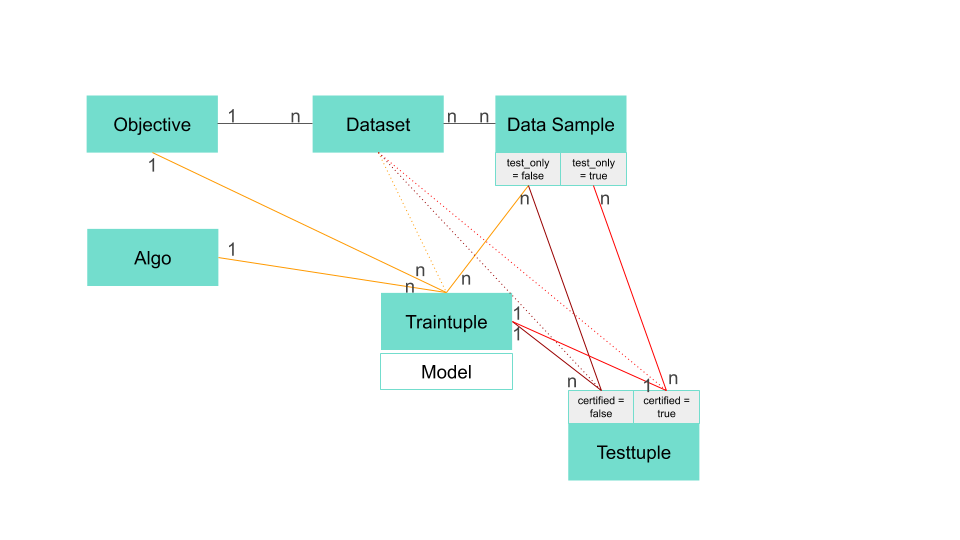
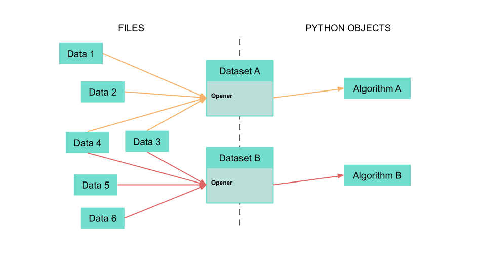

# Substra's concepts

This document describes the main concepts to be considered when using Substra.

All of the concepts mentioned below are assets (basically a set of files) which are associated with a unique identifier on the platform. Below is a global figure gathering all the assets and the links between each other.

## Objective

An objective is simply made of:
* a test dataset, that is to say a data manager associated with several test data samples
* a metrics script ([python implementation](https://github.com/SubstraFoundation/substratools/blob/dev/docs/api.md#metrics)).

It mainly aims at standardising the evaluation process of ML models. Since Substra focuses on supervised learning, each models trained on Substra has to be linked to an objective for evaluation.

## Dataset

A *dataset* is the abstraction that manages a coherent collection of *data samples* for a specific purpose.
It makes the link between a set of **data samples** and an **Objective** through an **opener**.

A *dataset* is composed of:

- an **opener**: it is in fact a script that opens and loads data in memory to fit the purpose of the objective ([python implementation](https://github.com/SubstraFoundation/substratools/blob/dev/docs/api.md#opener)). It can also apply preprocessing to the **data samples**.   
- a description: define the opener interface, that is to say what is returned by the opener.

For now Substra users only work with labelled datasets. Substra users are expected to design preprocess and build specific clean and labelled datasets by applying preprocessing tasks and for a specific objective. Part of the operations can be done in the opener.

### Data samples and datasets

Datasets are not a fixed set of data samples. Data samples can be linked to multiple datasets and new data samples can be linked to existing datasets even if these already have links to other data samples.

Datasets act as an interface between algorithms and objectives on one side and data samples on the other side. 

### Data opener

A data opener is a script which reads files and returns in-memory objects that algorithms and metrics will be able to use.

### Link with other concepts

A dataset can only be associated with a single objective.

## Algo

An algo is a script (typically a python file) for defining and training an ML architecture, together with a specific context specifying the dependencies (represented as a Dockerfile) for running the script.

The Docker container is built from an archive containing:
* a Dockerfile and the required dependencies
* an algo python script

The algo must follow a specific template to be executed properly, basically overloading a train and a predict function ([python implementation](https://github.com/SubstraFoundation/substratools/blob/dev/docs/api.md#algo)).

### Link with other concepts

An algorithm is linked to a unique objective.

## Model

A model is an architecture and a set of parameters specifying completely a predictive function. Typically, it corresponds to the weights of a neural networks in the form of a parsable file (e.g. json or hdf5). Substra helps training new models from older ones by using an algorithm and a dataset.

### Link with other concepts

A model is linked with one or several input models, a dataset, and an algo (and a objective by transitivity).

## Traintuple

A traintuple is the explicit specification of a training task. It contains the references of all the assets involved in the training task:
* the train data samples
* the data manager
* the algo
* the set of input models (optional)

A sequence of traintuple defines a training tajectory.

### Link with other concepts

A traintuple is linked with an objective, one algo, several models, and several train data samples.

## Testtuple

A testtuple is the explicit specification of a testing task, corresponding to the evaluation of a model on test data.  It contains the references of all the assets involved in the testing task:
* the traintuple (and therefore the model)
* the algo
* the data manager
* the test data samples

However, this can be reduced to simply providing the sole traintuple. The platform will explore its relationship with other assets to find the matching algo, data manager and test data samples.

Using the metrics of the objective linked to the algo, a performance is computed.

### Link with other concepts

A testtuple is linked with a traintuple.
