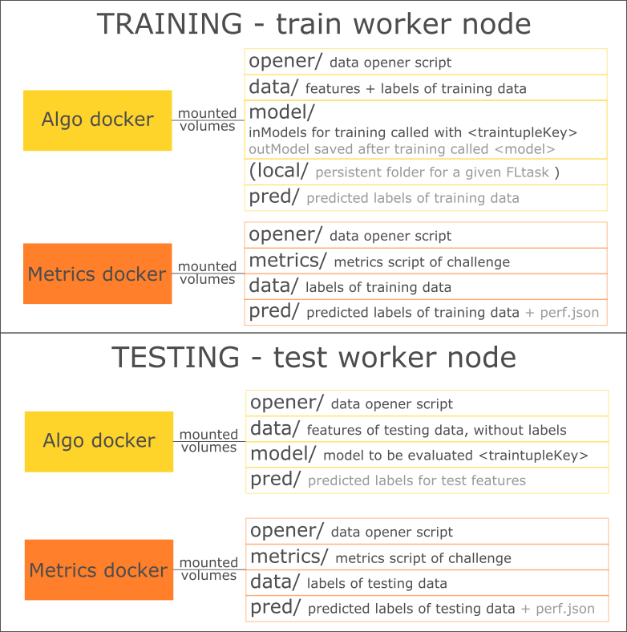

# Machine Learning tasks

Training and testing tasks are specified by [traintuples](./concepts.md#traintuple) and [testtuples](./concepts.md#testtuple) within Substra.
In particular, they contain the specification of train or test data, that are located in one node for a given `traintuple` or `testtuple`. 
The training and testing tasks take place in the node where data are located. 

> This document detail how training and testing tasks are managed within a node by the Substra framework. 

## Train and test data

Each data asset is labelled as either *test* or *train* data. An objective then references which data assets should be used during the testing phase of an algorithm through the `test_data_keys` objective.
Of course, only assets set as test data can be referenced as test data for an objective, and only the ones set as train data can be referenced by traintuples for training. This ensures test data can never be used during the training phase.
However, it is possible to specify testing tasks with train data, in order to enable cross-validation.  

In other words, 
- `traintuples` can only have train data that are labelled as train data.
- `testtuples` can have test data that are:
    - labelled as test data. This corresponds to a `certified testtuple` that can be used to benchmark models for a given objective. 
    - labelled as train data. This corresponds to a testtuple to enable cross-validation.

## Training task
 
When a new traintuple is added to Substra, the node containing the associated data will execute the training task. 
Within this node, Substra creates a new docker container containing the algorithm and mounts in separated volumes its training dependencies:
* the **data** volume contains all train datas in separate directories (identified by their key)
* the **opener** volume contains the opener library provided by the dataset
* the **model** volume contains the input models (identified by their key)
* the **pred** volume is an empty volume where the predictions made by the generated model must be saved
* optionaly, for a specific federated learning tasks, a *local* folder that is persistent from one model update to another within the node.

Substra then runs the algorithm **in training mode** and 
* a new model is generated and saved to the **model** volume, 
* predictions are made by the model on the same data it used for training and saved to the **pred** volume

A new container is then automatically created. Its goal is to compute the metrics on the predicted data. It mounts the following volumes:
* the **data**, **opener** and **pred** volumes are the same as for the previous container
* the **metrics** volume contains the objective metrics script

This time however, the **pred** volume contains the predictions. The metrics script is therefore able to compare them with the actual values in **data**. It generates a **perf.json** file containing the score and saves it to the **pred** volume. 

At this point, the training is over.

## Testing task

A testing task is triggered when a new testtuple is added to the platform. 
It occurs in the node where the associated test data are located. 

As for the training phase, it happens in two steps: 1) computation of predictions, 2) computation of the associated score.

For prediction, Substra creates a new docker container containing the algorithm with the following volumes:
* **data** which contains the testing data (defined through the `test_data_keys` property of the objective),
* **opener** which contain the opener library provided by the dataset,
* **model** which contain the model generated during the training phase,
* **pred** where the prediction made on test data must be saved.

Substra then runs the algorithm **in testing mode** and predictions are saved to the **pred** volume.

At this point, the score computation step starts and works exactly like the one in training. 

## Summary of volumes

