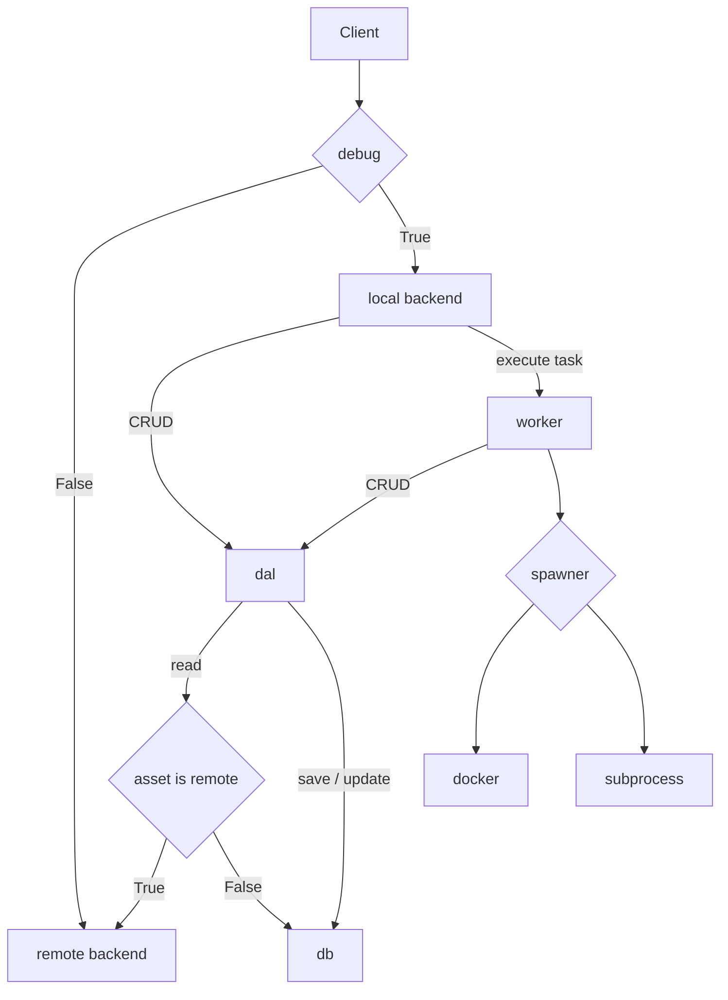

# Substra technical documentation

Client operations:

```mermaid
graph TD;
    Client-->debug{debug}
    debug-->|False|remotebackend[remote backend]
    debug-->|True|local[local backend]
    local-->|CRUD|dal
    dal-->|read|isremote{asset is remote}
    isremote-->|True|remotebackend
    isremote-->|False|db
    dal-->|save / update|db
    local-->|execute task|worker
    worker-->|CRUD|dal
    worker-->spawner{spawner}
    spawner-->docker
    spawner-->subprocess

    click Client "https://github.com/owkin/substra/blob/main/substra/sdk/client.py"
    click debug "https://github.com/owkin/substra/blob/main/substra/sdk/client.py#L75"
    click remotebackend "https://github.com/owkin/substra/blob/main/substra/sdk/backends/remote/backend.py"
    click local "https://github.com/owkin/substra/blob/main/substra/sdk/backends/local/backend.py"
    click dal "https://github.com/owkin/substra/blob/main/substra/sdk/backends/local/dal.py"
    click db "https://github.com/owkin/substra/blob/main/substra/sdk/backends/local/db.py"
    click worker "https://github.com/owkin/substra/blob/main/substra/sdk/backends/local/compute/worker.py"
    click spawner "https://github.com/owkin/substra/blob/main/substra/sdk/backends/local/compute/worker.py#L69"
    click docker "https://github.com/owkin/substra/blob/main/substra/sdk/backends/local/compute/spawner/docker.py"
    click subprocess "https://github.com/owkin/substra/blob/main/substra/sdk/backends/local/compute/spawner/subprocess.py"
```
